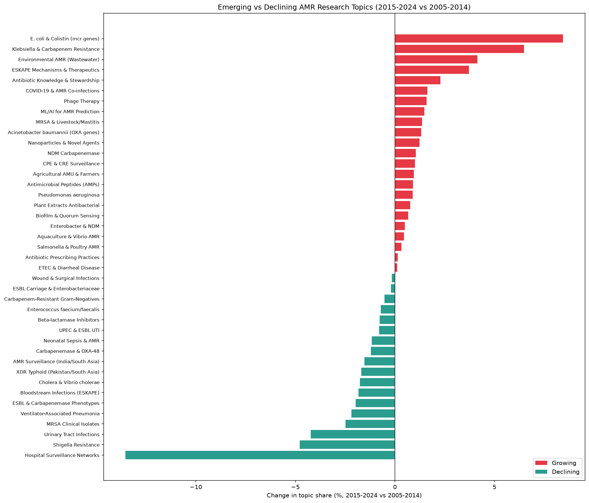
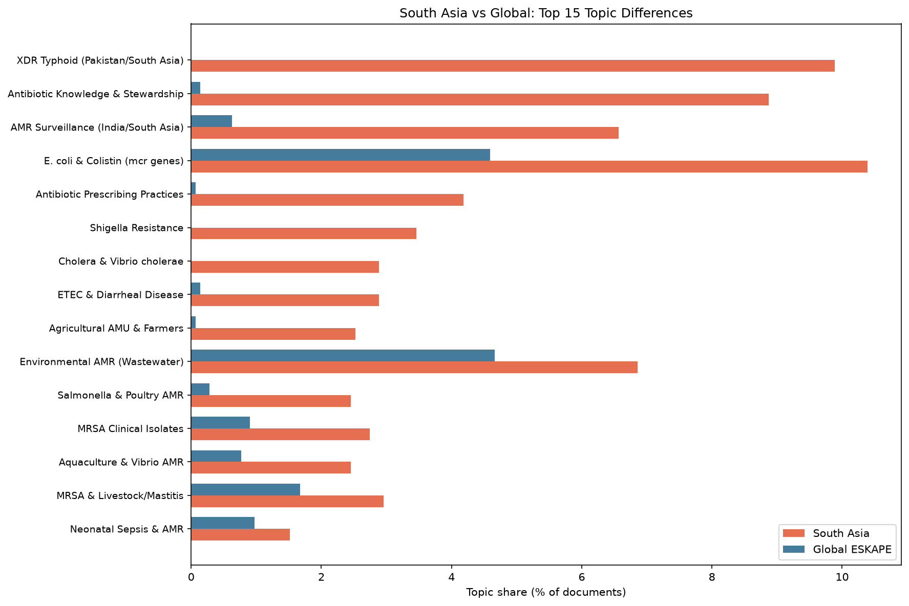
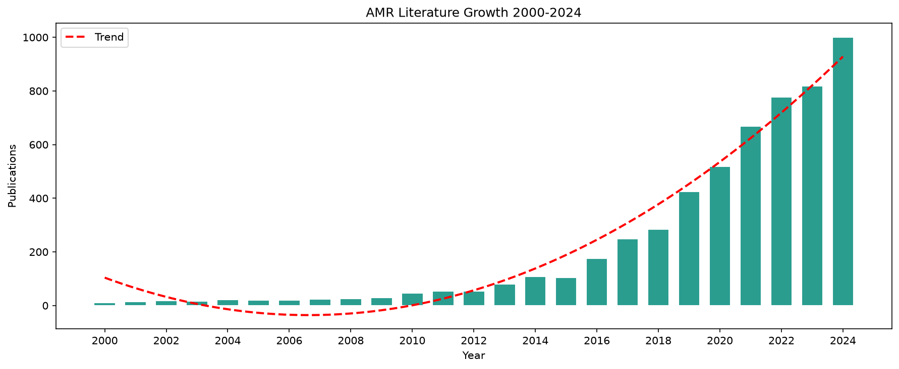

# AMR Literature NLP Analysis

NLP-based topic modeling and trend analysis of 5,647 PubMed abstracts on antimicrobial resistance in ESKAPE pathogens and South Asia (2000-2024), using BERTopic with sentence-transformers.

## Key Figures

### Emerging vs Declining AMR Research Topics

### South Asia vs Global Topic Profile

### AMR Literature Growth 2000-2024

## Key Findings

### 1. Fastest Growing Topics (2015-2024 vs 2005-2014)
- E. coli and Colistin (mcr genes): +8.44% — driven by global mcr-1 discovery in 2015
- Klebsiella and Carbapenem Resistance: +6.49% — NDM/KPC/OXA-48 proliferation
- Environmental AMR (Wastewater): +4.15% — One Health research expansion
- ESKAPE Mechanisms and Therapeutics: +3.72% — shift from surveillance to solutions
- Antibiotic Knowledge and Stewardship: +2.28% — WHO Global Action Plan impact

### 2. Declining Topics
- Hospital Surveillance Networks: -13.53% — field matured from describing to solving resistance
- Shigella Resistance: -4.78%
- Urinary Tract Infections: -4.23%

### 3. South Asia-Specific Research Profile
South Asian AMR literature is strongly differentiated from global ESKAPE literature:
- XDR Typhoid (Pakistan/South Asia): 9.9% of South Asia literature vs 0.0% globally
- Antibiotic Knowledge and Stewardship: 8.9% vs 0.1% globally
- AMR Surveillance (India/South Asia): 6.6% vs 0.6% globally
- E. coli and Colistin (mcr genes): 10.4% vs 4.6% globally

### 4. Field Maturation Pattern
The shift from Hospital Surveillance Networks (-13.5%) toward ESKAPE Mechanisms and Therapeutics (+3.7%), ML/AI for AMR Prediction (+0.9%), and Phage Therapy (+0.9%) indicates the AMR research field transitioned from descriptive surveillance to mechanistic understanding and novel therapeutics over this 24-year period.

## Dataset

- Source: PubMed via NCBI Entrez API (Biopython)
- 3 search queries: ESKAPE global, South Asia AMR, AMR mechanisms
- 5,647 unique abstracts with text (deduplicated by PMID)
- Year range: 2000-2024
- 41 topics identified by BERTopic

## Pipeline

1. fetch_pubmed_abstracts.py — fetches abstracts via 3 PubMed queries
2. run_bertopic.py — fits BERTopic with sentence-transformers (all-MiniLM-L6-v2), UMAP, HDBSCAN
3. analyze_trends.py — topic growth analysis, South Asia vs global comparison, figures

## Tech Stack

- NLP: BERTopic, sentence-transformers (all-MiniLM-L6-v2), UMAP, HDBSCAN
- Data: PubMed via NCBI Entrez (Biopython)
- Analysis: Python, pandas, numpy
- Visualization: matplotlib

## Local Setup

git clone https://github.com/usamamanzoor1121-pixel/amr-literature-nlp.git
cd amr-literature-nlp
conda create -n amr-nlp python=3.11 -y
conda activate amr-nlp
pip install torch --index-url https://download.pytorch.org/whl/cpu
pip install biopython pandas numpy matplotlib bertopic sentence-transformers umap-learn hdbscan scikit-learn
python scripts/fetch_pubmed_abstracts.py
python scripts/run_bertopic.py
python scripts/analyze_trends.py

## Author

Usama Manzoor
JSMU Diagnostic Laboratory and Blood Bank, Karachi, Pakistan
GitHub: https://github.com/usamamanzoor1121-pixel
LinkedIn: https://www.linkedin.com/in/usama-manzoor-042595182/
